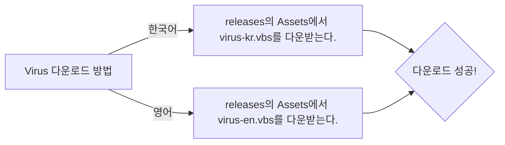

# Virus

이 프로젝트는 vbs file로 작성하였으며 ~~굉장히 위험한 바이러스이고
결코 단순한 로직이 아닙니다. 방심하지 마십시오.~~

>더 강력한 실제 바이러스를 찾고 계신다면 저의 **Repositories**중 [Batch_File_Project](https://github.com/Anion15/Batch_File_Project) 참고하세요.
>>위의 **Batch_File_Project**는 진짜 위험한 바이러스입니다. 하지만 적정하지 마세요, [Detailed recovery methods](https://github.com/Anion15/Batch_File_Project?tab=readme-ov-file#detailed-recovery-methods)에는 Batch_File_Project의 복구 방법을 게재하고 있습니다.

# Virus 작동 방식

 1. "virus-kr" 또는 "virus-en"을 실행
> 
 
 2. 예(Y) 또는 아니요(N), 취소 버튼을 클릭
> 

# Virus 최소사양 & 권장사양 안내

| 항목 | 최소사양 | 권장사양 |
|--|--|--|
| 운영체제 | Windows 7/8/8.1/10 -64-Bit | Windows 10 -64-Bit |
| CPU | Intel 4004 or AMD Am386 | Intel Core i9-14900K or AMD Ryzen 9 7950X |
| 메모리 | 2MB | 32GB |
| 하드디스크 여유공간 | 4KB | 256GB |
| 그래픽 카드 | GeForce 2 MX or ATI Radeon 7000  | NVIDIA GeForce RTX 4090 or AMD Radeon RX 7900 XTX |
| GPU Memory | 8MB | 10GB |

# Virus 다운로드 방법

> 별거 아니지만 "mermaid graph LR"로 좀 멋지게 표현하고 싶었어요. -anion15

# Virus 릴리즈 업데이트 로그
| 릴리즈 버전 | 업데이트 로그 |
|--|--|
| 1.0.0v | 기본 로직 추가 |
| 1.5.0v (예정) | 예외 error 처리문 추가 |

# 여담
이 프로젝트를 만들기 위해서 2시간이 걸렸는데
2분 동안 업로드하고
10분 동안 바이러스를 만들고
1시간 48분 동안 이 README 파일을 만들고 있었네요,

흔히 이럴 때 배보다 배꼽이 더 크다고 말하곤 하죠 
